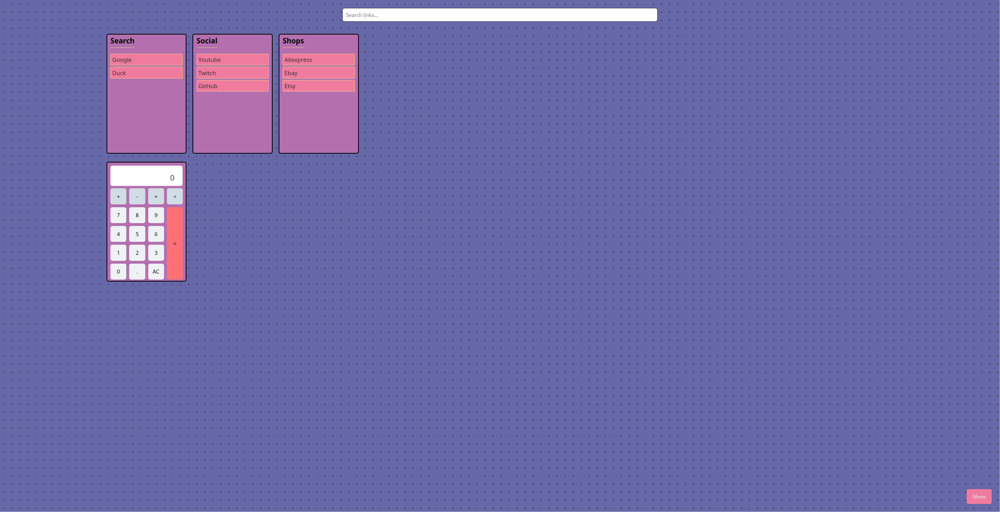

# Simple Link Visualizer App



This project is a simple web application that allows users to organize and visualize their favorite links. It features:

* Displaying links categorized by topic.
* An API to add new links to specific categories.
* An API to create new categories.
* An API to reorder links within a category.
* **Command Mode:** A command-line interface accessible through the search bar (by starting with `:`) allows you to perform actions:
    * `:link-delete <name>`: Deletes a link with the specified name.
    * `:category-delete <name>`: Deletes an entire category with the specified name and all its links.
    * `:open <name>`: Opens the link with the specified name in the current tab.
    * `:open-new-tab <name>`: Opens the link with the specified name in a new tab.
	* `:toggle-forms ` : Toggle open the forms.
	* `:open-category <name>`: Opens all links in a given category.
	* `:category-rename <name> `: Renames a given category.
	* `:link-move-category <name> <category> `: Move a link to another category.
* **Command Autocomplete:** When typing a command (starting with `:`), the search bar will display a dropdown list of available commands as suggestions.

It's built using Deno, a simple, modern, and secure runtime for JavaScript and TypeScript.

## Setup

To run this project, you need to have Deno installed on your system. Follow the instructions below based on your operating system.

### Installing Deno

**Using a Package Manager:**

You can also install Deno using a package manager:

* **macOS (Homebrew):**
    ```bash
    brew install deno
    ```
* **Linux (Debian/Ubuntu):**
    ```bash
    sudo apt update
    sudo apt install deno
    ```
* **Linux (Arch Linux) using Pacman:**
    If you are using Arch Linux or a distribution based on it (like Manjaro), you can install Deno using the `pacman` package manager:
    ```bash
    sudo pacman -S deno
    ```
* **Windows (Scoop):**
    ```powershell
    scoop install deno
    ```
* **Windows (Chocolatey):**
    ```bash
    choco install deno
    ```

### Verifying the Installation

After installation, you can verify that Deno is installed correctly by running the following command in your terminal:

```bash
deno --version
```

## Run the Project
```bash
deno run --allow-net --allow-read --allow-write server.ts
```

## How to Use

1.  **Organize Links:** Drag individual link items within their categories to rearrange them.
2.  **Reorder Categories:** Drag entire category sections to change their order on the page.
3.  **Command Mode:**
    * Focus on the search bar (you can use the `Escape` key as a shortcut).
    * Type a command starting with a colon (`:`).
    * As you type, autocomplete suggestions for available commands will appear below the search bar.
    * Use the **up** and **down arrow keys** to highlight a suggestion. The search bar will update with the highlighted command.
    * Press **Enter** to execute the highlighted command.
    * Alternatively, you can continue typing the command and press `Enter` to execute it.
4.  **Search:** (Placeholder - implement your search functionality in the `else` block of the `handleCommand` function in `main.js`).
5.  **Clear Search Bar:** Use `Alt + Backspace` to quickly clear the content of the search bar.
6.  **Focus Search Bar:** Press the `Escape` key to quickly focus on the search bar.

## Technical Details

* **HTML:** Structure of the page with categories and links.
* **CSS (`style.css`):** Styling of the layout, categories, links, search bar, and autocomplete suggestions.
* **JavaScript (`main.js`):** Handles the interactive features:
    * Drag and drop functionality using the HTML5 Drag and Drop API.
    * Event listeners for the search bar to enable command mode and autocomplete.
    * `fetch` API to communicate with the server for actions like deleting and reordering links/categories.
* **Server (Deno):** A simple Deno server (`server.ts`) manages the `links.json` file, providing and updating the link data.

## Server Endpoints Used

* `/api/links` (GET): Retrieves the initial link data.
* `/api/links` (POST): Adds a new link to a category.
* `/api/categories` (POST): Adds a new category.
* `/api/reorder-links` (POST): Updates the order of links within a category (also used for deleting links by sending the updated list without the deleted link).
* `/api/reorder-categories` (POST): Updates the order of categories (also used for deleting categories by sending the updated list without the deleted category).
